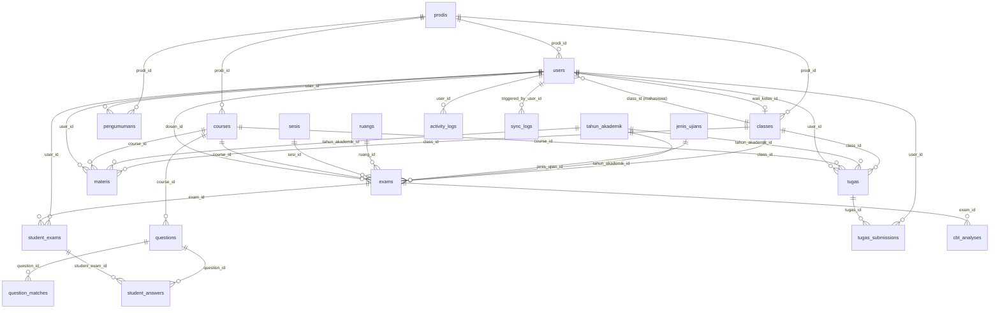

# PROJECT KNOWLEDGE BASE
## E-Learning STIKesMu Lhokseumawe

> **Dibuat**: 2026-07-12 | **Tujuan**: Dokumen ini memungkinkan AI lain (Claude) memahami seluruh project tanpa membaca source code dari awal.

---

## 1. Project Overview

### Nama Ujian / Aplikasi
**E-Learning STIKesMu Lhokseumawe** (dengan modul CBTMu — Sekolah Tinggi Ilmu Kesehatan Muhammadiyah Lhokseumawe)

### Tujuan Aplikasi
Platform ujian online (CBT) internal kampus yang terintegrasi dengan sistem akademik (Neo Feeder / PDDIKTI). Menggantikan ujian berbasis kertas, memungkinkan dosen mengelola bank soal, menjadwalkan ujian, dan melakukan analisis butir soal secara otomatis.

### Target User
| Role | Deskripsi |
|---|---|
| **Admin** | Staff IT / Administrator kampus yang mengelola master data dan melakukan monitoring ujian |
| **Dosen** | Pengajar yang membuat soal, ujian, materi pembelajaran, dan tugas |
| **Mahasiswa** | Peserta ujian yang mengerjakan tes dan mengunduh materi/tugas |

### Problem yang Diselesaikan
- Proses ujian konvensional berbasis kertas rentan terhadap kecurangan dan memakan waktu koreksi yang lama.
- Tidak ada sistem penilaian otomatis berbasis analisis statistik (tingkat kesukaran, daya beda, reliabilitas).
- Data akademik (prodi, kelas, mahasiswa, dosen, mata kuliah) terfragmentasi; aplikasi ini mengintegrasikannya langsung dengan Neo Feeder PDDIKTI.
- Tidak adanya portal pembelajaran digital terpadu (E-Learning) untuk membagikan materi dan tugas harian.

### Teknologi Utama

| Layer | Teknologi |
|---|---|
| **Backend Framework** | Laravel 11 (`^11.0`) |
| **PHP Version** | `^8.2` |
| **Database Engine** | MySQL (production), SQLite (dev/testing fallback) |
| **Frontend Styling** | Tailwind CSS v4 (via Vite) |
| **Frontend JavaScript** | Vanilla JS + Axios |
| **UI Alert/Modal** | SweetAlert2 v11 (CDN) |
| **Icon Library** | Font Awesome 6.4.0 (CDN) |
| **Typography** | Inter + Plus Jakarta Sans (Google Fonts) |
| **Build & Asset Bundler**| Vite 5 + `laravel-vite-plugin` |
| **Excel Operations** | `phpoffice/phpspreadsheet ^5.8` (PHP) |
| **Word Generation** | `docx ^9.7.1` (npm) |
| **Template Engine** | Laravel Blade |
| **Drivers** | Session (`database`), Cache (`database`), Queue (`database`) |
| **External API** | Neo Feeder PDDIKTI (`https://feeder.stikeslhokseumawe.ac.id/ws/live2.php`) |

---

## 2. Folder Structure

```
stikes_cbt-cmplct/
│
├── app/
│   ├── Console/                  # Artisan commands (default Laravel)
│   ├── Http/
│   │   ├── Controllers/          # Semua controller utama (13 file)
│   │   └── Middleware/           # Middleware kustom (RoleMiddleware.php)
│   ├── Models/                   # 19 Eloquent model representasi tabel DB
│   ├── Providers/                # Service provider default Laravel
│   └── Services/                 # Business logic services (Feeder, FeederSync, QuestionImport)
│
├── bootstrap/                    # Bootstrap script & cache optimasi Laravel
├── config/                       # Konfigurasi aplikasi default Laravel
│
├── database/
│   ├── migrations/               # 15 file migrasi database (struktur tabel)
│   ├── seeders/                  # DatabaseSeeder.php untuk inisialisasi data dev/production
│   └── database.sqlite           # SQLite fallback untuk pengujian/development
│
├── public/                       # Web root directory (index.php, compiled assets)
│
├── resources/
│   ├── css/app.css               # Tailwind CSS entry point
│   ├── js/app.js                 # Vanilla JS entry point
│   └── views/
│       ├── admin/                # Views untuk dashboard dan fitur Admin
│       │   └── feeder/           # Sub-folder view monitoring integrasi feeder
│       ├── auth/                 # Form login view
│       ├── dosen/                # Views untuk dashboard dan fitur Dosen
│       ├── layouts/              # Master layout Blade per role
│       ├── mahasiswa/            # Views untuk ruang ujian dan dashboard Mahasiswa
│       └── welcome.blade.php     # Halaman landing/login terpadu
│
├── routes/
│   ├── web.php                   # Definisi semua routing web (214 baris)
│   └── console.php               # Konfigurasi schedule command artisan (default)
│
├── storage/                      # Tempat penyimpanan file upload, logs, dan framework cache
├── tests/                        # Automated tests (default PHPUnit)
├── vendor/                       # Dependensi PHP (Composer)
│
├── .env                          # Konfigurasi variabel lingkungan
├── ARCHITECTURE.md               # Catatan singkat arsitektur sistem
├── PROJECT_CONTEXT.md            # Aturan mutlak coding bagi pengembang/AI
├── composer.json                 # Konfigurasi dependensi PHP
├── package.json                  # Konfigurasi dependensi NPM
└── vite.config.js               # Konfigurasi build Vite
```

### Fungsi Folder Utama yang Berisi Custom Code

- **`app/Http/Controllers/`**: Mengatur interaksi HTTP request, melakukan validasi input request, berinteraksi dengan Eloquent ORM atau Service Layer, dan mengembalikan response JSON atau View.
- **`app/Models/`**: Menghubungkan tabel database ke class PHP, menetapkan mass-assignable attributes (`$fillable`), tipe data casting (`$casts`), serta relasi antar tabel (Eloquent relationships).
- **`app/Services/`**: Memisahkan logic bisnis yang kompleks dari Controller agar controller tetap ramping (Fat Model/Service, Skinny Controller). Berisi logic sinkronisasi API Feeder dan pembacaan berkas Excel/Word.
- **`app/Http/Middleware/`**: Memvalidasi request berdasarkan role pengguna (`RoleMiddleware.php`).
- **`database/migrations/`**: Mendokumentasikan dan mengeksekusi skema database relasional secara berurutan.
- **`resources/views/`**: Struktur halaman antarmuka pengguna berbasis Laravel Blade.
- **`routes/web.php`**: Berisi seluruh endpoint aplikasi yang dikelompokkan berdasarkan middleware role.

---

## 3. Architecture

### Deskripsi Arsitektur
Aplikasi ini dibangun menggunakan arsitektur **Monolith MVC (Model-View-Controller) dengan Service Layer**. 

### Alasan Pemilihan Arsitektur
- **Monolith Terstruktur**: Mempermudah deployment dan pemeliharaan pada server VPS berkapasitas rendah.
- **Service Layer**: Memisahkan kode integrasi API eksternal yang kompleks (`FeederSyncService`, `QuestionImportService`) dari Controller sehingga kode mudah di-test dan dipelihara.
- **Eager Loading Enforcement**: Diwajibkan di `PROJECT_CONTEXT.md` untuk menghindari masalah performa query N+1, terutama saat memuat data ujian dan jawaban mahasiswa yang berjumlah besar.
- **Persistent Shuffling**: Untuk menghemat CPU, pengacakan soal dilakukan *hanya sekali* ketika mahasiswa mengklik "Mulai Ujian". Urutan acak disimpan permanen pada kolom `question_order` di tabel `student_answers`. Ini mencegah query berat `ORDER BY RAND()` dipanggil setiap kali mahasiswa berpindah halaman soal.

---

## 4. Module Analysis

### 4.1 Module: Authentication

- **Fungsi**: Mengelola proses login, verifikasi kredensial, proteksi route berdasarkan sesi, dan proses logout.
- **Flow**:
  1. Pengguna mengakses route `/` (ditangani `AuthController@showLogin`).
  2. Input kredensial (`login` berupa username atau email dan `password`) dikirim via Axios POST ke `/login`.
  3. Kredensial divalidasi, password dicocokkan menggunakan enkripsi Bcrypt.
  4. Sesi diregenerasi (`session()->regenerate()`), riwayat login dicatat ke `activity_logs`, dan mengembalikan JSON berisi redirect path sesuai role.
  5. Jika logout dipanggil (`POST /logout`), sesi dihancurkan, log dicatat, dan pengguna diarahkan kembali ke `/`.
- **Controller**: [AuthController.php](file:///e:/STIKESMU_IT_PROJECT/stikes_cbt-cmplct/app/Http/Controllers/AuthController.php)
- **Model**: [User.php](file:///e:/STIKESMU_IT_PROJECT/stikes_cbt-cmplct/app/Models/User.php)
- **Route**: `GET /`, `POST /login`, `POST /logout`
- **Database/Relasi**: Berhubungan langsung dengan tabel `users` dan `sessions`.

---

### 4.2 Module: Admin Dashboard & Master Data

- **Fungsi**: Mengelola seluruh master data akademik (Tahun Akademik, Program Studi, User, Mata Kuliah, Kelas, Ruang Ujian, Sesi, dan Jenis Ujian), serta mengelola pengumuman dan riwayat sistem log audit.
- **Flow**:
  1. Admin masuk ke `/admin`.
  2. Mengakses menu Master Data untuk melakukan CRUD (Create, Read, Update, Delete) entitas.
  3. Dapat mengimpor data user (dosen/mahasiswa) dan mata kuliah menggunakan berkas Excel (.xlsx).
- **Controller**: [AdminController.php](file:///e:/STIKESMU_IT_PROJECT/stikes_cbt-cmplct/app/Http/Controllers/AdminController.php), [TahunAkademikController.php](file:///e:/STIKESMU_IT_PROJECT/stikes_cbt-cmplct/app/Http/Controllers/TahunAkademikController.php), [ProdiController.php](file:///e:/STIKESMU_IT_PROJECT/stikes_cbt-cmplct/app/Http/Controllers/ProdiController.php), [UjianMasterController.php](file:///e:/STIKESMU_IT_PROJECT/stikes_cbt-cmplct/app/Http/Controllers/UjianMasterController.php), [PengumumanController.php](file:///e:/STIKESMU_IT_PROJECT/stikes_cbt-cmplct/app/Http/Controllers/PengumumanController.php)
- **Model**: `User`, `TahunAkademik`, `Prodi`, `ClassRoom`, `Course`, `Ruang`, `Sesi`, `JenisUjian`, `Pengumuman`, `ActivityLog`.
- **Route Group**: `/admin/*` (Middleware: `auth`, `role:admin`).

---

### 4.3 Module: Bank Soal (Dosen & Admin)

- **Fungsi**: Mengelola butir soal per mata kuliah yang dikelompokkan berdasarkan kategori, tingkat kesulitan, dan jenis tipe soal.
- **Flow**:
  1. Dosen mengakses menu Bank Soal, memilih mata kuliah tujuan.
  2. Dosen dapat membuat soal secara manual atau mengunggah berkas Excel/Word melalui `QuestionImportService`.
  3. Mendukung tipe soal: Pilihan Ganda (PG), PG Kompleks, Isian Singkat, Benar/Salah, Menjodohkan, dan Essai.
- **Controller**: [DosenController.php](file:///e:/STIKESMU_IT_PROJECT/stikes_cbt-cmplct/app/Http/Controllers/DosenController.php) (fungsi `bankSoal`, `questionStore`, `questionUpdate`, dll), [AdminController.php](file:///e:/STIKESMU_IT_PROJECT/stikes_cbt-cmplct/app/Http/Controllers/AdminController.php) (fungsi `bankSoalIndex` dll).
- **Model**: [Question.php](file:///e:/STIKESMU_IT_PROJECT/stikes_cbt-cmplct/app/Models/Question.php), `QuestionMatch` (untuk tipe menjodohkan).
- **Service**: [QuestionImportService.php](file:///e:/STIKESMU_IT_PROJECT/stikes_cbt-cmplct/app/Services/QuestionImportService.php) (mengolah berkas unggahan Excel menggunakan PhpSpreadsheet dan Word docx zip extraction).

---

### 4.4 Module: Pelaksanaan & Monitoring Ujian

- **Fungsi**: Menjadwalkan ujian (oleh Dosen/Admin) dan memantau status pengerjaan mahasiswa secara real-time.
- **Flow**:
  1. Dosen/Admin membuat jadwal ujian (`exams`) dengan durasi, sebaran soal, acak opsi, nilai KKM, dan token.
  2. Saat ujian berlangsung, Admin mengakses halaman Monitoring.
  3. Admin dapat mereset sesi mahasiswa yang bermasalah, menangguhkan pengerjaan (suspend/toggle-pending), atau menambah durasi pengerjaan secara dinamis.
- **Controller**: `AdminController` (fungsi `monitoringIndex`, `monitoringDetail`, `monitoringResetStudent`, `monitoringTogglePending`, `monitoringAdjustTime`).
- **Model**: [Exam.php](file:///e:/STIKESMU_IT_PROJECT/stikes_cbt-cmplct/app/Models/Exam.php), [StudentExam.php](file:///e:/STIKESMU_IT_PROJECT/stikes_cbt-cmplct/app/Models/StudentExam.php), `StudentAnswer`.

---

### 4.5 Module: Exam Engine API (Internal)

- **Fungsi**: Menyediakan API internal untuk mengontrol jalannya ujian yang sedang dikerjakan mahasiswa.
- **Endpoints**:
  - **Start Exam (`POST /api/v1/exam/start`)**: Memvalidasi token ujian, mengecek jadwal, membatasi kelas, memulai transaksi database, men-shuffle soal, dan menyimpan urutan soal di tabel `student_answers`.
  - **Save Answer (`POST /api/v1/exam/save-answer`)**: Menyimpan jawaban terpilih atau teks isian secara asinkronus (Axios AJAX) tiap kali mahasiswa memilih opsi.
  - **Timer Sync (`GET /api/v1/exam/timer-sync/{id}`)**: Mengembalikan sisa waktu pengerjaan real-time dari server. Jika waktu habis, otomatis men-trigger fungsi finalisasi.
  - **Submit Final (`POST /api/v1/exam/submit-final`)**: Melakukan kalkulasi jawaban benar-salah di dalam transaksi database, menyimpan skor akhir, dan mengubah status pengerjaan menjadi `finished`.
- **Controller**: [ExamApiController.php](file:///e:/STIKESMU_IT_PROJECT/stikes_cbt-cmplct/app/Http/Controllers/ExamApiController.php).

---

### 4.6 Module: Analisis Butir Soal

- **Fungsi**: Melakukan analisis statistik butir soal untuk menilai kualitas pertanyaan yang diujikan (psikometrik).
- **Flow**:
  1. Dosen/Admin membuka menu Analisis Soal, memilih ujian yang telah diselesaikan (minimal oleh 5 mahasiswa).
  2. Sistem membagi peserta menjadi kelompok atas (27% skor tertinggi) dan kelompok bawah (27% skor terendah).
  3. Dihitung:
     - **Tingkat Kesukaran (P)**: Proporsi jawaban benar (kategori: Sulit, Sedang, Mudah).
     - **Daya Beda (D)**: Kemampuan soal membedakan mahasiswa pandai dan kurang pandai (kategori: Sangat Baik, Baik, Cukup, Buruk, Sangat Buruk).
     - **Cronbach Alpha**: Koefisien reliabilitas keseluruhan tes.
  4. Hasil analisis dapat diekspor langsung ke berkas CSV.
- **Controller**: [AnalisisController.php](file:///e:/STIKESMU_IT_PROJECT/stikes_cbt-cmplct/app/Http/Controllers/AnalisisController.php).
- **Model**: `Exam`, `StudentExam`, `StudentAnswer`, `Question`.

---

### 4.7 Module: E-Learning (Materi & Tugas)

- **Fungsi**: Distribusi materi pembelajaran dan pengumpulan tugas terintegrasi bagi dosen dan mahasiswa.
- **Flow**:
  1. Dosen mengunggah materi (tipe file, link tautan, atau teks HTML) dan membuat penugasan dengan tenggat waktu (`deadline`).
  2. Mahasiswa melihat daftar materi dan mengunduhnya, serta mengirimkan jawaban tugas (`tugas_submissions`).
  3. Dosen memeriksa berkas jawaban tugas mahasiswa dan memberikan nilai beserta catatan umpan balik.
- **Controller**: [ElearningController.php](file:///e:/STIKESMU_IT_PROJECT/stikes_cbt-cmplct/app/Http/Controllers/ElearningController.php).
- **Model**: `Materi`, `Tugas`, `TugasSubmission`.

---

### 4.8 Module: Neo Feeder Integration

- **Fungsi**: Sinkronisasi data entitas akademik lokal dengan server pusat Neo Feeder PDDIKTI secara satu arah.
- **Flow**:
  1. Sistem melakukan autentikasi ke server Neo Feeder menggunakan token yang di-cache selama 2 jam.
  2. Admin memicu sinkronisasi (melalui UI atau programmatically) untuk entitas Semester, Program Studi, Kelas, Mahasiswa, Dosen, dan Mata Kuliah.
  3. Data yang diunduh diproses secara bertahap (upsert/update-insert) dan riwayatnya disimpan ke `sync_logs`.
- **Controller**: [FeederController.php](file:///e:/STIKESMU_IT_PROJECT/stikes_cbt-cmplct/app/Http/Controllers/FeederController.php).
- **Service**: [FeederService.php](file:///e:/STIKESMU_IT_PROJECT/stikes_cbt-cmplct/app/Services/FeederService.php) (caching token, HTTP requests), [FeederSyncService.php](file:///e:/STIKESMU_IT_PROJECT/stikes_cbt-cmplct/app/Services/FeederSyncService.php) (logic mapping data dan penanganan transaksi data, 891 baris).

---

## 5. Database Analysis

### Skema Tabel Database

#### 5.1 Tabel: `users`
- **Tujuan**: Menyimpan informasi pengguna aplikasi (admin, dosen, mahasiswa).
- **Skema**:
  - `id` (PK, bigint, auto-increment)
  - `feeder_id` (varchar(36), unique, nullable) - UUID dari Neo Feeder
  - `name` (varchar) - Nama lengkap
  - `username` (varchar, unique) - Digunakan untuk login
  - `email` (varchar, unique) - Digunakan untuk login/kontak
  - `role` (varchar, default: 'mahasiswa') - `admin` | `dosen` | `mahasiswa`
  - `class_id` (FK, nullable, cascade on delete) -> `classes.id` (untuk mahasiswa)
  - `nim` (varchar, nullable) - Nomor Induk Mahasiswa
  - `nidn` (varchar, nullable) - Nomor Induk Dosen
  - `prodi_id` (FK, nullable, set null on delete) -> `prodis.id`
  - `photo` (varchar, nullable) - Path file foto profil
  - `angkatan` (varchar, nullable) - Tahun masuk
  - `status` (enum: 'aktif','cuti','do','lulus', default: 'aktif')
  - `no_hp` (varchar, nullable)
  - `tanggal_lahir` (date, nullable)
  - `alamat` (varchar, nullable)
  - `jabatan` (varchar, nullable) - Jabatan akademik dosen
  - `feeder_status` (varchar(10), nullable)
  - `feeder_inactive` (boolean, default: false)
  - `feeder_synced_at` (timestamp, nullable)
  - `password` (varchar) - Bcrypt hash
  - `remember_token` (varchar, nullable)
  - `email_verified_at` (timestamp, nullable)
  - `created_at`, `updated_at` (timestamp)

#### 5.2 Tabel: `prodis`
- **Tujuan**: Informasi Program Studi di kampus.
- **Skema**:
  - `id` (PK, bigint, auto-increment)
  - `feeder_id` (varchar(36), unique, nullable)
  - `kode` (varchar, unique) - e.g., 'S1-KEP'
  - `nama` (varchar) - e.g., 'S1 Ilmu Keperawatan'
  - `jenjang` (enum: 'D3','D4','S1','S2','Profesi', default: 'S1')
  - `akreditasi` (varchar, nullable)
  - `is_aktif` (boolean, default: true)
  - `feeder_synced_at` (timestamp, nullable)
  - `created_at`, `updated_at` (timestamp)

#### 5.3 Tabel: `classes`
- **Tujuan**: Representasi rombongan belajar/kelas mahasiswa.
- **Skema**:
  - `id` (PK, bigint, auto-increment)
  - `feeder_id` (varchar(36), unique, nullable)
  - `prodi_id` (FK, nullable, set null on delete) -> `prodis.id`
  - `name` (varchar)
  - `description` (text, nullable)
  - `angkatan` (varchar, nullable)
  - `feeder_semester_id` (varchar(20), nullable)
  - `wali_kelas_id` (FK, nullable, set null on delete) -> `users.id`
  - `feeder_synced_at` (timestamp, nullable)
  - `created_at`, `updated_at` (timestamp)

#### 5.4 Tabel: `tahun_akademik`
- **Tujuan**: Menyimpan periode tahun akademik aktif.
- **Skema**:
  - `id` (PK, bigint, auto-increment)
  - `feeder_semester_id` (varchar(20), unique, nullable)
  - `nama` (varchar) - e.g., '2025/2026 Ganjil'
  - `tahun_mulai` (year)
  - `semester` (enum: 'ganjil','genap')
  - `is_aktif` (boolean, default: false) - Hanya boleh satu record bernilai true
  - `created_at`, `updated_at` (timestamp)

#### 5.5 Tabel: `courses`
- **Tujuan**: Representasi kurikulum/mata kuliah.
- **Skema**:
  - `id` (PK, bigint, auto-increment)
  - `feeder_id` (varchar(36), unique, nullable)
  - `prodi_id` (FK, nullable, set null on delete) -> `prodis.id`
  - `code` (varchar, unique) - e.g., 'KDP101'
  - `name` (varchar)
  - `description` (text, nullable)
  - `sks` (integer, default: 2)
  - `is_praktikum` (boolean, default: false)
  - `feeder_synced_at` (timestamp, nullable)
  - `created_at`, `updated_at` (timestamp)

#### 5.6 Tabel: `questions`
- **Tujuan**: Menyimpan butir-butir soal ujian.
- **Skema**:
  - `id` (PK, bigint, auto-increment)
  - `course_id` (FK, cascade on delete) -> `courses.id`
  - `question_type` (enum: 'pg','pg_kompleks','essai','isian','menjodohkan','benar_salah', default: 'pg')
  - `category` (varchar, nullable) - Kategori/bab materi soal
  - `difficulty` (varchar, default: 'sedang') - `mudah` | `sedang` | `sulit`
  - `question_text` (text) - Teks soal (HTML)
  - `question_image` (varchar, nullable) - Path gambar soal
  - `option_a`, `option_b`, `option_c`, `option_d`, `option_e` (text) - Pilihan jawaban
  - `correct_option` (char(1) atau text) - Opsi benar (A-E) atau kata kunci isian
  - `bobot` (decimal(5,2), default: 1.00)
  - `explanation` (text, nullable) - Pembahasan jawaban
  - `created_at`, `updated_at` (timestamp)

#### 5.7 Tabel: `question_matches`
- **Tujuan**: Pasangan pencocokan untuk tipe soal menjodohkan.
- **Skema**:
  - `id` (PK, bigint, auto-increment)
  - `question_id` (FK, cascade on delete) -> `questions.id`
  - `urutan` (integer)
  - `item_kiri` (text)
  - `item_kiri_image` (varchar, nullable)
  - `item_kanan` (text)
  - `item_kanan_image` (varchar, nullable)
  - `created_at`, `updated_at` (timestamp)

#### 5.8 Tabel: `ruangs`
- **Tujuan**: Menyimpan daftar ruang kelas/laboratorium komputer ujian.
- **Skema**:
  - `id` (PK, bigint, auto-increment)
  - `nama` (varchar) - e.g., 'Lab Komputer A'
  - `kapasitas` (integer, default: 30)
  - `lokasi` (varchar, nullable)
  - `is_aktif` (boolean, default: true)
  - `created_at`, `updated_at` (timestamp)

#### 5.9 Tabel: `sesis`
- **Tujuan**: Menyimpan slot waktu/sesi ujian harian.
- **Skema**:
  - `id` (PK, bigint, auto-increment)
  - `nama` (varchar) - e.g., 'Sesi 1'
  - `jam_mulai` (time)
  - `jam_selesai` (time)
  - `is_aktif` (boolean, default: true)
  - `created_at`, `updated_at` (timestamp)

#### 5.10 Tabel: `jenis_ujians`
- **Tujuan**: Kategori pelaksanaan ujian (UTS, UAS, dll).
- **Skema**:
  - `id` (PK, bigint, auto-increment)
  - `kode` (varchar, unique) - e.g., 'UTS', 'UAS'
  - `nama` (varchar)
  - `bobot_nilai` (decimal(5,2), default: 100.00) - Persentase kontribusi nilai akhir
  - `deskripsi` (text, nullable)
  - `is_aktif` (boolean, default: true)
  - `created_at`, `updated_at` (timestamp)

#### 5.11 Tabel: `exams`
- **Tujuan**: Menyimpan jadwal dan aturan pelaksanaan ujian.
- **Skema**:
  - `id` (PK, bigint, auto-increment)
  - `course_id` (FK, cascade on delete) -> `courses.id`
  - `dosen_id` (FK, cascade on delete) -> `users.id`
  - `class_id` (FK, nullable, set null on delete) -> `classes.id` - Jika null, terbuka untuk seluruh kelas
  - `tahun_akademik_id` (FK, nullable, set null on delete) -> `tahun_akademik.id`
  - `jenis_ujian_id` (FK, nullable, set null on delete) -> `jenis_ujians.id`
  - `ruang_id` (FK, nullable, set null on delete) -> `ruangs.id`
  - `sesi_id` (FK, nullable, set null on delete) -> `sesis.id`
  - `exam_type` (varchar, default: 'UTS')
  - `title` (varchar)
  - `description` (text, nullable)
  - `petunjuk` (text, nullable) - Instruksi pengerjaan ujian
  - `start_time` (datetime)
  - `end_time` (datetime)
  - `duration_minutes` (integer)
  - `token` (varchar(6)) - Token akses ujian
  - `is_random` (boolean, default: true) - Mengaktifkan acak soal
  - `total_questions` (integer, default: 50) - Jumlah soal yang ditarik dari bank
  - `passing_grade` (decimal(5,2), default: 70.00) - Nilai KKM
  - `created_at`, `updated_at` (timestamp)

#### 5.12 Tabel: `student_exams`
- **Tujuan**: Sesi ujian aktif yang diikuti oleh mahasiswa tertentu.
- **Skema**:
  - `id` (PK, bigint, auto-increment)
  - `user_id` (FK, cascade on delete) -> `users.id` (Mahasiswa)
  - `exam_id` (FK, cascade on delete) -> `exams.id`
  - `started_at` (datetime)
  - `finished_at` (datetime, nullable)
  - `suspended_at` (timestamp, nullable) - Waktu saat disuspend proktor
  - `score` (decimal(5,2), nullable)
  - `status` (varchar, default: 'progress') - `progress` | `finished` | `pending` (suspension state)
  - `created_at`, `updated_at` (timestamp)

#### 5.13 Tabel: `student_answers`
- **Tujuan**: Lembar jawaban mahasiswa untuk tiap butir soal dalam satu sesi ujian.
- **Skema**:
  - `id` (PK, bigint, auto-increment)
  - `student_exam_id` (FK, cascade on delete) -> `student_exams.id`
  - `question_id` (FK, cascade on delete) -> `questions.id`
  - `selected_option` (char(1), nullable) - Pilihan ganda (A-E)
  - `answer_text` (text, nullable) - Teks jawaban essai/isian
  - `is_doubtful` (boolean, default: false) - Flag ragu-ragu
  - `question_order` (integer) - Nomor urut tampilan soal bagi mahasiswa tersebut
  - `is_correct` (boolean, nullable) - Hasil penilaian otomatis
  - `nilai_dosen` (decimal(5,2), nullable) - Hasil penilaian manual dosen (untuk essai)
  - `feedback_dosen` (text, nullable)
  - `created_at`, `updated_at` (timestamp)

#### 5.14 Tabel: `activity_logs`
- **Tujuan**: Menyimpan riwayat aktivitas penting (audit trail).
- **Skema**:
  - `id` (PK, bigint, auto-increment)
  - `user_id` (FK, nullable, cascade on delete) -> `users.id`
  - `activity` (varchar)
  - `description` (text, nullable)
  - `ip_address` (varchar(45), nullable)
  - `created_at`, `updated_at` (timestamp)

#### 5.15 Tabel: `pengumumans`
- **Tujuan**: Menayangkan informasi penting secara tertarget di dashboard.
- **Skema**:
  - `id` (PK, bigint, auto-increment)
  - `user_id` (FK, nullable, set null on delete) -> `users.id` (Pembuat)
  - `judul` (varchar)
  - `isi` (text)
  - `prodi_id` (FK, nullable, set null on delete) -> `prodis.id` - Null berarti tayang di semua prodi
  - `target` (enum: 'semua','mahasiswa','dosen', default: 'semua')
  - `tanggal_aktif` (date, nullable)
  - `tanggal_expired` (date, nullable)
  - `is_aktif` (boolean, default: true)
  - `created_at`, `updated_at` (timestamp)

#### 5.16 Tabel: `materis`
- **Tujuan**: E-Learning - Mengunggah materi perkuliahan.
- **Skema**:
  - `id` (PK, bigint, auto-increment)
  - `user_id` (FK, cascade on delete) -> `users.id` (Dosen)
  - `course_id` (FK, cascade on delete) -> `courses.id`
  - `class_id` (FK, nullable, set null on delete) -> `classes.id`
  - `tahun_akademik_id` (FK, nullable, set null on delete) -> `tahun_akademik.id`
  - `judul` (varchar)
  - `deskripsi` (text, nullable)
  - `tipe` (enum: 'file','link','text', default: 'file')
  - `file_path` (varchar, nullable) - Path file lokal di storage
  - `link_url` (varchar, nullable) - URL eksternal
  - `konten` (text, nullable) - Konten materi berbasis teks HTML
  - `tanggal_tayang` (date, nullable)
  - `is_aktif` (boolean, default: true)
  - `created_at`, `updated_at` (timestamp)

#### 5.17 Tabel: `tugas`
- **Tujuan**: E-Learning - Membuat lembar penugasan.
- **Skema**:
  - `id` (PK, bigint, auto-increment)
  - `user_id` (FK, cascade on delete) -> `users.id` (Dosen)
  - `course_id` (FK, cascade on delete) -> `courses.id`
  - `class_id` (FK, nullable, set null on delete) -> `classes.id`
  - `tahun_akademik_id` (FK, nullable, set null on delete) -> `tahun_akademik.id`
  - `judul` (varchar)
  - `deskripsi` (text, nullable)
  - `poin_nilai` (decimal(5,2), default: 100.00)
  - `deadline` (datetime, nullable)
  - `tanggal_tayang` (date, nullable)
  - `is_aktif` (boolean, default: true)
  - `created_at`, `updated_at` (timestamp)

#### 5.18 Tabel: `tugas_submissions`
- **Tujuan**: E-Learning - Pengumpulan berkas tugas oleh mahasiswa.
- **Skema**:
  - `id` (PK, bigint, auto-increment)
  - `tugas_id` (FK, cascade on delete) -> `tugas.id`
  - `user_id` (FK, cascade on delete) -> `users.id` (Mahasiswa)
  - `file_path` (varchar, nullable)
  - `catatan` (text, nullable)
  - `nilai` (decimal(5,2), nullable) - Dinilai oleh dosen
  - `feedback_dosen` (text, nullable)
  - `submitted_at` (datetime, nullable)
  - `created_at`, `updated_at` (timestamp)

#### 5.19 Tabel: `cbt_analyses`
- **Tujuan**: Menyimpan cache hasil analisis butir soal (saat ini tidak aktif digunakan / *dead storage* karena kalkulasi dilakukan on-the-fly).
- **Skema**:
  - `id` (PK, bigint, auto-increment)
  - `exam_id` (FK, cascade on delete) -> `exams.id`
  - `question_id` (FK, cascade on delete) -> `questions.id`
  - `tingkat_kesukaran` (decimal(5,4), nullable)
  - `daya_beda` (decimal(5,4), nullable)
  - `reliabilitas` (decimal(5,4), nullable)
  - `distribusi_jawaban` (json, nullable)
  - `created_at`, `updated_at` (timestamp)

#### 5.20 Tabel: `sync_logs`
- **Tujuan**: Log integrasi sinkronisasi PDDIKTI Neo Feeder.
- **Skema**:
  - `id` (PK, bigint, auto-increment)
  - `sync_type` (varchar(50)) - `full` | `mahasiswa` | `dosen` | `kelas` | `prodi` | `semester`
  - `triggered_by` (varchar(50)) - `scheduler` | `manual_admin` | `artisan`
  - `triggered_by_user_id` (FK, nullable, set null on delete) -> `users.id`
  - `started_at` (timestamp)
  - `finished_at` (timestamp, nullable)
  - `status` (enum: 'running','success','failed', default: 'running')
  - `total_fetched` (integer, default: 0)
  - `total_inserted` (integer, default: 0)
  - `total_updated` (integer, default: 0)
  - `total_deactivated` (integer, default: 0)
  - `total_errors` (integer, default: 0)
  - `error_log` (text, nullable) - Berisi log JSON error dump
  - `notes` (text, nullable)
  - `duration_seconds` (integer, nullable)
  - `created_at`, `updated_at` (timestamp)

---

### Entity-Relationship Diagram (ERD)



---

## 6. API Analysis

Seluruh endpoint backend didefinisikan di routes web, dengan beberapa bertindak sebagai API internal yang mengembalikan JSON untuk diproses AJAX (Axios).

### API Monitoring & Pelaksanaan Ujian (Internal)

| Method | URL | Controller@Method | Validation | Purpose | Auth / Middleware |
|---|---|---|---|---|---|
| `POST` | `/api/v1/exam/start` | `ExamApiController@start` | `exam_id` (exists), `token` (string) | Validasi token, mengacak soal, dan menginisialisasi sesi ujian mahasiswa. | `auth`, `role:mahasiswa` |
| `POST` | `/api/v1/exam/save-answer` | `ExamApiController@saveAnswer` | `student_exam_id`, `question_id`, `option_id` (nullable), `answer_text` (nullable), `is_doubtful` (boolean) | Menyimpan jawaban satu butir soal secara real-time via AJAX. | `auth`, `role:mahasiswa` |
| `GET` | `/api/v1/exam/timer-sync/{id}` | `ExamApiController@timerSync` | Parameter URL `{id}` (student_exam_id) | Sinkronisasi sisa waktu ujian antara client dan server, men-trigger auto-submit jika sisa waktu 0. | `auth`, `role:mahasiswa` |
| `POST` | `/api/v1/exam/submit-final` | `ExamApiController@submitFinal` | `student_exam_id`, `force` (nullable) | Mengakhiri ujian secara sadar, mengoreksi otomatis tipe soal non-essai, dan menghitung skor akhir. | `auth`, `role:mahasiswa` |
| `POST` | `/api/v1/exam/reset-session` | `ExamApiController@resetSession` | `student_exam_id` | Menghapus log lembar jawaban dan sesi ujian mahasiswa (karena kecurangan/keluar halaman tanpa izin). | `auth`, `role:mahasiswa` |

### API Integrasi Neo Feeder PDDIKTI

| Method | URL | Controller@Method | Request Params | Response | Purpose | Auth / Middleware |
|---|---|---|---|---|---|---|
| `POST` | `/admin/feeder/test` | `FeederController@testConnection` | - | `{status: 'ok/error', message: '...'}` | Menguji konektivitas API server Neo Feeder lokal. | `auth`, `role:admin` |
| `POST` | `/admin/feeder/sync` | `FeederController@sync` | `entity` ('all', 'semester', 'prodi', etc.) | `{success: boolean, message: string, stats: array}` | Memicu proses penarikan data secara manual dari Feeder. | `auth`, `role:admin` |
| `GET` | `/admin/feeder/logs` | `FeederController@logs` | - | `{logs: [...]}` | Mengambil daftar logs sinkronisasi terbaru untuk live status progress bar. | `auth`, `role:admin` |
| `GET` | `/admin/feeder/logs/{id}` | `FeederController@logDetail` | - | JSON SyncLog Object | Melihat detail kegagalan sinkronisasi entitas tertentu. | `auth`, `role:admin` |
| `POST` | `/admin/feeder/peek` | `FeederController@peek` | `act` (string), `filter` (string), `limit` (int) | `{success: bool, sample: [...], fields: [...]}` | Membuka dump data dari server Neo Feeder untuk tujuan debugging field mapping. | `auth`, `role:admin` |

---

## 7. Route Analysis

Seluruh routing dikelompokkan secara terstruktur di [web.php](file:///e:/STIKESMU_IT_PROJECT/stikes_cbt-cmplct/routes/web.php):

- **Public Routes (Guest Only)**:
  - `GET /`: Menampilkan form login (jika sudah terautentikasi otomatis didorong ke dashboard masing-masing role).
  - `POST /login`: Proses validasi autentikasi kredensial.
- **Authenticated Routes (Shared)**:
  - `POST /logout`: Menghapus sesi login.
- **Admin Protected Routes (`/admin/*`)** - Middleware: `auth`, `role:admin`:
  - Mengelola master data akademik (CRUD prodi, tahun-akademik, user, mata kuliah, kelas, ruang, sesi, jenis ujian).
  - Monitoring ujian dan manipulasi state pengerjaan mahasiswa (`/admin/monitoring/*`).
  - Analisis butir soal (`/admin/analisis-soal/*`).
  - Integrasi Neo Feeder (`/admin/feeder/*`).
  - System logs audit trail (`/admin/audit-system`).
- **Dosen Protected Routes (`/dosen/*`)** - Middleware: `auth`, `role:dosen`:
  - CRUD bank soal, filter pencarian, preview, dan import Excel/Word.
  - CRUD jadwal ujian khusus mata kuliah yang diampu.
  - Rekap nilai mahasiswa dan ekspor berkas CSV (`/dosen/rekap-nilai/*`).
  - E-Learning: Mengunggah materi kuliah dan membuat tugas harian.
- **Mahasiswa Protected Routes (`/mahasiswa/*`)** - Middleware: `auth`, `role:mahasiswa`:
  - Halaman Dashboard ujian aktif.
  - Ruang Ujian (`/mahasiswa/ruang-ujian/{id}`).
  - Riwayat ujian selesai dan review pembahasan.
  - Mengunduh materi kuliah dan mengirim tugas.

---

## 8. Authentication Flow

```
[ Form Login ]
      │ (Username/Email & Password)
      ▼
AuthController@login 
      │ 
      ├──► Memeriksa filter_var(..., FILTER_VALIDATE_EMAIL)
      │     ├── TRUE  ► Gunakan field 'email'
      │     └── FALSE ► Gunakan field 'username'
      │
      ├──► Panggil Auth::attempt($credentials, $remember_token)
      │     │
      │     ├── Gagal (401 JSON) ◄─────────────────────────────────────┐
      │     │                                                         │
      │     └── Berhasil (200 JSON)                                    │
      │           │                                                   │
      │           ├──► Sesi diregenerasi (session()->regenerate())     │
      │           ├──► Simpan log masuk (ActivityLog::log())          │
      │           └──► Kembalikan path dashboard tujuan sesuai role ──┘
      ▼
[ Redirect UI via JS ] -> (/admin OR /dosen OR /mahasiswa)
```

- **Sesi Session**: Diatur menggunakan tabel `sessions` di database (`SESSION_DRIVER=database` di `.env`). Masa aktif sesi diatur selama 120 menit (`SESSION_LIFETIME=120`).
- **Middleware Proteksi**: `RoleMiddleware` mengekstrak string parameter role dan membandingkannya dengan properti `$user->role`. Jika tidak sesuai, aplikasi langsung memicu `abort(403, 'Unauthorized action.')`.

---

## 9. Business Flow

### Siklus Pengerjaan Ujian Mahasiswa

```
1. Mahasiswa Buka Dashboard
   └─ Lihat daftar ujian aktif (start_time <= now <= end_time)
   
2. Klik Tombol "Masuk Ujian"
   └─ Masukkan token keamanan ujian (6 digit)

3. API Start Exam Dipicu (/api/v1/exam/start)
   ├─ Validasi token (case-insensitive)
   ├─ Cek kuota kelas & rentang waktu jadwal
   ├─ JIKA ada sesi lama bertipe 'progress' -> Teruskan sesi (resume)
   └─ JIKA sesi baru -> DB::transaction:
         ├─ Buat baris baru di tabel `student_exams` (status: 'progress')
         ├─ Tarik kumpulan soal dari mata kuliah
         ├─ JIKA `is_random` = true -> Acak array soal
         ├─ Ambil sejumlah `total_questions`
         └─ Simpan soal ke tabel `student_answers` dengan index `question_order` berurutan (1, 2, 3...)
         
4. Masuk ke View Halaman Ujian (/mahasiswa/ruang-ujian/{id})
   ├─ Eager load data `StudentAnswer` dengan relasi `question` (Cegah N+1)
   ├─ Tampilkan navigasi soal di sebelah kanan dan box soal di kiri
   ├─ Tiap klik jawaban -> trigger Axios POST ke (/api/v1/exam/save-answer) -> update `selected_option`
   └─ Tiap 30 detik -> sinkronisasi sisa durasi ke server (/api/v1/exam/timer-sync/{id})
   
5. Mahasiswa Selesai / Waktu Habis -> Trigger Submit Final (/api/v1/exam/submit-final)
   └─ DB::transaction:
         ├─ Tarik semua jawaban di tabel `student_answers`
         ├─ Bandingkan jawaban mahasiswa dengan kunci jawaban berdasarkan jenis soal:
         │    ├─ pg & benar_salah : selected_option == correct_option (is_correct = true)
         │    ├─ isian : answer_text case-insensitive match correct_option (is_correct = true)
         │    ├─ pg_kompleks : selected_option string match correct_option (is_correct = true)
         │    └─ essai : default (is_correct = false) - Harus dinilai manual oleh dosen
         ├─ Hitung skor akhir = (jumlah_benar / total_soal) * 100
         ├─ Simpan nilai ke kolom `score` di `student_exams`
         ├─ Ubah status sesi menjadi 'finished'
         └─ Catat audit trail log
```

---

## 10. UI Analysis

### Desain Sistem & Estetika
Aplikasi didesain menggunakan **Tailwind CSS v4** dengan tema korporat akademik hijau tua terstruktur (SIAKAD STIKESMu style) dengan dominasi warna hijau gelap (`#1A4731` / `bg-emerald-800`).

### Elemen Layouting Utama
- **Sidebar Kiri**: Menyimpan navigasi utama per role, bertipe fixed 220px, otomatis terlipat (collapsible) pada layar mobile/tablet. Dilengkapi info widget profil ringkas di bagian bawah.
- **Header Atas**: Menampung hamburger menu toggle, logo instansi, indikator role badge dinamis, live digital clock (diperbarui tiap detik via JS), dan tombol logout.
- **Audit Logs Table**: Menampilkan aktivitas sistem dalam format list tabel responsif yang rapi.
- **Exam Navigator Grid**: Dalam ruang ujian mahasiswa, terdapat sidebar grid nomor soal yang berubah warna secara real-time:
  - **Abu-abu**: Soal belum dikunjungi/belum diisi.
  - **Hijau**: Soal sudah dijawab.
  - **Kuning**: Soal diberi tanda ragu-ragu.
  - **Border Biru**: Soal aktif yang sedang dibuka.

### Tipografi & Komponen
- **Font**: Menggunakan *Inter* untuk tulisan konten yang bersih, dan *Plus Jakarta Sans* pada bagian judul card/halaman demi menonjolkan estetika modern premium.
- **Modal CRUD**: Form tambah/ubah master data menggunakan overlay modal popup kustom yang dikontrol state JavaScript.
- **SweetAlert2**: Digunakan secara konsisten untuk menampilkan notifikasi konfirmasi tindakan (seperti hapus data/logout) dan pesan sukses/error AJAX.

---

## 11. Component Analysis

Aplikasi mengandalkan template engine bawaan **Laravel Blade** secara penuh (Server-Side Rendering) yang dikombinasikan dengan modul JavaScript asinkronus (Axios) di sisi client.

### Struktur Komponen Master Layouts
- **[layouts.app](file:///e:/STIKESMU_IT_PROJECT/stikes_cbt-cmplct/resources/views/layouts/app.blade.php)**: Mengatur head HTML, instalasi stylesheet & Javascript via `@vite`, deklarasi token CSRF global untuk Axios, dan fungsi Javascript helper utilitas.
- **layouts.admin**: Menyediakan menu navigasi navigasi spesifik Superadmin (Master data, feeder, monitoring).
- **layouts.dosen**: Menyediakan navigasi dosen (Bank Soal, Ujian, Nilai, E-Learning).
- **layouts.mahasiswa**: Layout minimalis yang memfokuskan mahasiswa pada materi dan halaman ujian (tanpa sidebar pada halaman pengerjaan tes).

---

## 12. Asset Analysis

### Compile Tools & Bundlers
- **Vite 5**: Mengompilasi resource aset modern dengan plugin `@tailwindcss/vite` untuk mempercepat pemuatan halaman.
- **Asset Entry Points**: `resources/css/app.css` (Tailwind imports) dan `resources/js/app.js` (JavaScript bootstraps).

### Aset Eksternal (CDN Libraries)
- **SweetAlert2 (v11)**: Manajemen modal dialog responsif.
- **FontAwesome (v6.4.0)**: Menyediakan simbol visual ikon di seluruh bagian menu sidebar dan tombol aksi.
- **Axios JS**: Menangani request AJAX di background tanpa memicu reload halaman penuh.

---

## 13. Dependency Analysis

### Dependensi PHP (`composer.json`)
- `laravel/framework` (`^11.0`): Mesin inti backend MVC.
- `phpoffice/phpspreadsheet` (`^5.8`): Membaca berkas template soal (.xlsx) yang diunggah oleh Dosen untuk disimpan langsung ke database.
- `laravel/tinker` (`^2.9`): CLI interaktif untuk administrasi/debugging database secara cepat di VPS.

### Dependensi JavaScript (`package.json`)
- `tailwindcss` & `@tailwindcss/vite` (`^4.3.1`): Utility-first CSS engine v4 terbaru.
- `docx` (`^9.7.1`): Dependensi untuk mengekstraksi atau membuat template berkas soal Word (.docx) secara langsung.

---

## 14. Security Analysis

### Analisis Risiko & Evaluasi Keamanan

| Vektor Ancaman | Evaluasi Sistem Saat Ini | Rekomendasi Mitigasi |
|---|---|---|
| **SQL Injection** | **Aman**. Sistem menggunakan Laravel Eloquent ORM & Query Builder secara konsisten yang menerapkan parameter binding secara internal. | Hindari penggunaan raw SQL query manual (`DB::raw`) di masa depan jika input berasal dari request user. |
| **CSRF Attack** | **Aman**. Laravel mengaktifkan middleware pencegahan CSRF secara global. Axios secara otomatis menyisipkan header token CSRF dari meta-tag. | Pertahankan penggunaan tag `@csrf` pada setiap form HTML murni. |
| **Hardcoded Credentials** | 🔴 **Bahaya (Kritikal)**. Berkas `FeederService.php` menampung URL, e-mail master, dan password master Neo Feeder secara polos/plain di dalam source code. | Segera pindahkan parameter autentikasi ke dalam berkas `.env` dan panggil via `config()`. |
| **Bypass SSL Verification** | 🔴 **Bahaya (Kritikal)**. Koneksi HTTP ke API Feeder memanggil method `withoutVerifying()`, menonaktifkan validasi sertifikat SSL. | Aktifkan validasi SSL di server production dengan sertifikat CA yang terpercaya guna menghindari serangan Man-in-the-Middle. |
| **XSS (Cross-Site Scripting)** | ⚠️ **Peringatan (Medium)**. Soal ujian (`question_text`) dirender di Blade menggunakan tag `{!! !!}` untuk mendukung formatting HTML (seperti tabel atau gambar dalam soal). | Gunakan parser HTML sanitizer (seperti HTMLPurifier) sebelum konten soal ditampilkan untuk menyaring tag skrip berbahaya. |
| **Authentication Bruteforce** | ⚠️ **Peringatan (Medium)**. Endpoint login `/login` tidak menerapkan rate limiting. | Tambahkan middleware rate limiter bawaan Laravel (`throttle:10,1`) pada route login. |
| **File Upload Vulnerability** | ⚠️ **Peringatan (Medium)**. Proses upload materi kuliah di `ElearningController` tidak membatasi ekstensi file secara ketat di sisi server. | Terapkan validasi berkas MIME-type secara ketat (`pdf, doc, docx, ppt, xls, zip`) dan batasi ukuran berkas maksimal (misal: 20MB). |

---

## 15. Performance Analysis

### Analisis Efisiensi Sistem & Query

- **Eager Loading Enforcement**:
  Halaman seperti dashboard mahasiswa dan ruang ujian telah menerapkan eager loading secara optimal.
  *Contoh*: `StudentAnswer::with('question')->where(...)` menghindari runtime query tambahan per nomor soal.
- **Potensi bottleneck query N+1 pada Analisis Soal**:
  Dalam `AnalisisController@getAnalysisData`, perhitungan nilai kelompok atas/bawah memicu query SQL di dalam perulangan `foreach` untuk memuat data jawaban mahasiswa.
  *Solusi*: Ambil seluruh data jawaban peserta sekaligus ke memori (koleksi Eloquent), lalu lakukan pemrosesan filter menggunakan method-method collection PHP.
- **Persistent Randomization**:
  Pilihan arsitektur untuk tidak mengacak soal di runtime query (`ORDER BY RAND()`) sangat menghemat utilisasi CPU database server MySQL, menjaga aplikasi tetap responsif meskipun diakses oleh ratusan mahasiswa secara simultan.

---

## 16. Coding Standard

- **Naming Conventions**:
  - Class menggunakan standar **PascalCase** (e.g., `ExamApiController`).
  - Method, variable, dan properti menggunakan **camelCase** (e.g., `saveAnswer`, `$studentExam`).
  - Penamaan file view menggunakan **snake_case** atau **kebab-case** secara konsisten.
  - Relasi database menggunakan snake_case lowercase (`student_exam_id`).
- **Structure Pattern**:
  - Penanganan request divalidasi terlebih dahulu menggunakan method inline `$request->validate()`.
  - Operasi manipulasi model selalu diapit oleh method pencatat log sistem `ActivityLog::log()`.
  - Service logic diletakkan terpisah di folder `app/Services`.

---

## 17. Data Flow

### Contoh Perjalanan Data: Pengiriman Satu Jawaban Ujian

```
[ Mahasiswa memilih Opsi B ]
      │ (Interaksi UI pada Browser)
      ▼
[ Axios POST Request ] -> URL: /api/v1/exam/save-answer
  payload: { student_exam_id: 5, question_id: 12, option_id: 'B' }
      │
      ▼
[ Web Routing ] -> routes/web.php (Filter auth & role:mahasiswa)
      │
      ▼
[ Controller ] -> ExamApiController@saveAnswer
  ├─ Memvalidasi tipe data input
  ├─ Memastikan user_id sesi ujian cocok dengan ID user aktif
  ├─ Memeriksa status sesi harus 'progress' (belum selesai/tidak ditangguhkan)
  └─ Memanggil Eloquent Model StudentAnswer untuk update field
      │
      ▼
[ Database Engine ] -> UPDATE student_answers SET selected_option = 'B' WHERE ...
      │
      ▼
[ HTTP Response ] -> 200 OK JSON { status: 'saved', saved_at: '2026-07-12 17:34:39' }
```

---

## 18. Configuration

Aplikasi dikonfigurasi melalui berkas variabel lingkungan `.env`:
- **Timezone**: Saat ini bernilai `APP_TIMEZONE=UTC`. Hal ini berisiko memicu ketidaksesuaian waktu mulai/selesai ujian sebesar 7 jam dengan waktu lokal Indonesia (WIB). Sebaiknya disesuaikan menjadi `Asia/Jakarta`.
- **Environment**: Berjalan di `APP_ENV=local` dengan `APP_DEBUG=true`. Mode debug harus dimatikan (`false`) sebelum aplikasi di-deploy secara publik untuk mencegah kebocoran informasi error.
- **Drivers**: Driver session, cache, dan queue dikonfigurasi ke opsi `database` agar tidak membebani memori RAM server VPS.

---

## 19. Error Handling

- **Error Validasi Form**: Secara otomatis dibalikkan oleh Laravel berupa kode HTTP `422 Unprocessable Entity` beserta detail error per kolom. Pada UI, error ini ditangkap secara umum oleh blok Catch Axios dan ditampilkan dalam SweetAlert2.
- **System Exception**: Operasi database krusial menggunakan blok `try-catch` di dalam penulisan controller. Jika terjadi kegagalan sistem database, error detail di-rollback secara aman dan response JSON 500 dikirimkan ke pengguna.

---

## 20. Deployment

### Kebutuhan Server & Konfigurasi Production

- **PHP Version**: 8.2 atau lebih tinggi.
- **PHP Extensions**: `pdo_mysql`, `mbstring`, `openssl`, `xml`, `zip` (untuk PhpSpreadsheet), dan `gd` (untuk rendering grafik analisis).
- **Database**: MySQL Server 8.0+.
- **Build toolchain**: Node.js v18+ dan NPM v9+ (untuk kompilasi aset frontend via Vite).
- **Direktori Permission**: Direktori `storage` dan `bootstrap/cache` wajib memiliki permission read-write (`chmod -R 775`).
- **Database Migrations & Seeding**:
  Untuk deployment pertama kali:
  ```bash
  php artisan migrate --seed
  ```
  Hal ini akan memigrasi skema database dan membuat akun default:
  - **Admin**: username `admin` / password `password`
  - **Dosen**: username `dosen` / password `dxdosen@`
  - **Mahasiswa**: username `250101001` / password `250101001`

---

## 21. Feature List

### Core Features (Ujian Online)
- [x] Manajemen multi-role login (Admin, Dosen, Mahasiswa).
- [x] Pembuatan bank soal dengan 6 variasi jenis tipe soal.
- [x] Import butir soal secara bulk via berkas Excel.
- [x] Penjadwalan ujian dengan token dinamis.
- [x] Halaman ujian dengan waktu countdown tersinkronisasi.
- [x] Skoring otomatis terintegrasi.
- [x] Dashboard rekapitulasi nilai dan opsi ekspor CSV.
- [x] Pembahasan soal pasca ujian (Review Mode).

### Admin & Proktor Features
- [x] Dashboard statistik ringkas.
- [x] Sinkronisasi satu arah dari server Neo Feeder PDDIKTI.
- [x] Sistem monitoring ujian peserta real-time.
- [x] Kemampuan suspensi ujian mahasiswa (Pending Mode).
- [x] Penambahan durasi waktu ujian dinamis per ujian.
- [x] Audit trail aktivitas seluruh user.
- [x] Pembuatan pengumuman tertarget prodi/role.

### E-Learning Features
- [x] Unggah materi kuliah (tipe file, tautan eksternal, atau teks HTML).
- [x] Penjadwalan tanggal tayang materi pembelajaran.
- [x] Pembuatan tugas dengan deadline.
- [x] Pengumpulan tugas oleh mahasiswa.
- [x] Lembar penilaian dan umpan balik tugas oleh Dosen.

---

## 22. TODO & Code Issues

1. **Scoring Ujian Essai Manual**: Saat ini, di `ExamApiController@submitFinalProcess`, tipe soal essai dilewatkan dan langsung dianggap salah (`is_correct = false`). Dosen belum memiliki interface khusus untuk mengoreksi dan mengubah kolom `nilai_dosen` pada tabel `student_answers` dari UI.
2. **Kalkulasi Analisis Soal Tidak Persist**: Tabel `cbt_analyses` saat ini kosong. Data hasil analisis butir soal dihitung ulang dari database setiap kali user memuat halaman analisis.
3. **Penyelarasan Zona Waktu**: Server beroperasi pada zona UTC, sedangkan pendaftaran jadwal menggunakan WIB. Hal ini rawan memicu kekacauan pembukaan jadwal tes.
4. **Feeder Credentials Exposed**: Variabel kredensial login API Neo Feeder yang bersifat sensitif masih ditulis secara hardcoded di dalam file service PHP.

---

## 23. Refactoring Opportunity

- **God Controller**: [AdminController.php](file:///e:/STIKESMU_IT_PROJECT/stikes_cbt-cmplct/app/Http/Controllers/AdminController.php) memiliki ukuran 33KB dengan total 874 baris kode. Controller ini bertanggung jawab atas terlalu banyak entitas (User CRUD, Mata kuliah CRUD, Monitoring, dan Jadwal Ujian). Sangat disarankan untuk memecahnya ke dalam controller mandiri yang lebih spesifik.
- **Duplikasi Logic Penilaian**: Logic pengoreksian soal dan penyimpanan score akhir diulang secara identik di `ExamApiController@submitFinalProcess` dan `MahasiswaController@forceSubmitSession`. Logic ini sebaiknya dipusatkan ke dalam satu helper/service class kustom (`ScoringService.php`).

---

## 24. Improvement Suggestion

### Skala Prioritas Pengembangan Aplikasi

#### 1. Prioritas Utama (Kritikal / Security & Time)
- Pindahkan konfigurasi Neo Feeder dari file `FeederService.php` ke file `.env` dan aktifkan kembali sertifikat SSL verification.
- Ubah konfigurasi zona waktu di `.env` menjadi `APP_TIMEZONE=Asia/Jakarta`.
- Tambahkan validasi tipe file di upload materi untuk mencegah eksekusi file script berbahaya (.php).

#### 2. Prioritas Tinggi (Fungsionalitas Inti)
- Buat modul antarmuka khusus Dosen untuk mengoreksi jawaban tipe soal essai mahasiswa secara manual.
- Simpan hasil kalkulasi analisis butir soal secara permanen ke tabel `cbt_analyses` agar tidak memperlambat database ketika jumlah data ujian telah bertambah banyak.
- Hilangkan duplikasi kode penilaian otomatis dengan mengekstrak fungsi ke `ScoringService`.

#### 3. Prioritas Menengah (UX & Fitur Tambahan)
- Implementasikan pembatasan rate limit login untuk mencegah serangan Brute Force.
- Tambahkan scheduler otomatis menggunakan command cron job sistem untuk sinkronisasi Neo Feeder secara periodik tiap malam.
- Tambahkan template dokumen PDF untuk cetak laporan nilai mahasiswa per kelas.

---

## 25. AI Context

Dokumen ringkas di bawah ini disediakan khusus agar AI lain (seperti Claude) dapat langsung memahami parameter proyek ini:

```yaml
APP_NAME: "E-Learning STIKesMu Lhokseumawe"

DESCRIPTION: >
  Aplikasi ujian berbasis komputer (CBT) internal terintegrasi akademik 
  yang digunakan di STIKES Muhammadiyah Lhokseumawe. Menyediakan fitur 
  Bank Soal, Jadwal Ujian, Monitoring Proktor, Analisis Butir Soal, 
  E-Learning, serta sinkronisasi satu arah dari server Neo Feeder PDDIKTI.

PURPOSE: >
  Menggantikan proses ujian kertas, meminimalisir kecurangan, menyediakan 
  analisis statistik kualitas soal secara otomatis, serta mengintegrasikan 
  data kurikulum dan mahasiswa langsung dengan Neo Feeder PDDIKTI.

TECH_STACK: >
  PHP 8.2+, Laravel 11, MySQL, Tailwind CSS v4, Vite 5, Axios JS, 
  SweetAlert2, PhpSpreadsheet, docx generator.

FRAMEWORK: "Laravel 11.x (Monolith MVC with Service Layer)"

ARCHITECTURE: >
  Monolithic MVC. Controller memproses request, Blade View menyajikan UI, 
  Eloquent Model menghubungkan DB. Logic integrasi eksternal dipisah ke 
  Service Layer (FeederSyncService, FeederService, QuestionImportService).

DATABASE: >
  MySQL (stikes_cbt). Tabel inti: users (role-based), prodis, classes, 
  tahun_akademik, courses, questions, exams, student_exams (sesi ujian), 
  student_answers (lembar jawaban), activity_logs (audit), sync_logs.

MAIN_MODULES:
  - Auth: Login terpadu email/username, redirect cerdas sesuai role.
  - Admin: Manajemen master data akademik, monitoring ujian proktor, sinkronisasi feeder.
  - Dosen: Manajemen bank soal, kelola ujian, rekap nilai, e-learning materi & tugas.
  - Mahasiswa: Kerjakan ujian (CBT Engine), unduh materi, kumpul tugas.
  - Exam Engine API: API asinkronus start, save-answer, timer-sync, submit-final.
  - Analisis Soal: Kalkulasi psikometrik tingkat kesukaran, daya beda, Cronbach Alpha.

AUTH_SYSTEM: >
  Session-based menggunakan Laravel auth default. Data sesi disimpan di database.
  Role dikelola via kolom 'role' pada tabel users (admin, dosen, mahasiswa). 
  Proteksi hak akses halaman dikelola via RoleMiddleware.

IMPORTANT_FILES:
  - routes/web.php (Pusat routing aplikasi)
  - app/Http/Controllers/ExamApiController.php (Engine ujian asinkronus)
  - app/Http/Controllers/AdminController.php (God Controller utama admin)
  - app/Services/FeederSyncService.php (Logic sinkronisasi data PDDIKTI)
  - app/Services/QuestionImportService.php (Import soal Excel)
  - resources/views/mahasiswa/exam-room.blade.php (UI Ruang Ujian mahasiswa)
  - resources/views/layouts/app.blade.php (Master layout global HTML/JS)

IMPORTANT_ROUTES:
  - GET  /                           : Halaman login
  - POST /login                      : Proses autentikasi
  - POST /api/v1/exam/start          : Memulai sesi ujian & shuffle soal
  - POST /api/v1/exam/save-answer    : Menyimpan jawaban (Axios AJAX)
  - GET  : /api/v1/exam/timer-sync/id: Sinkronisasi countdown timer server
  - POST /api/v1/exam/submit-final   : Finalisasi ujian & kalkulasi nilai
  - GET  /admin/monitoring/id        : Halaman pemantauan real-time proktor
  - POST /admin/feeder/sync          : Memicu sinkronisasi data Feeder

IMPORTANT_DATABASE_TABLES:
  - users (Menyimpan profil & role user)
  - exams (Menyimpan spesifikasi token, jadwal & durasi ujian)
  - student_exams (Status progres pengerjaan ujian mahasiswa)
  - student_answers (Rekaman jawaban & urutan soal acak per mahasiswa)
  - questions (Bank soal dari 6 tipe pertanyaan)

CODING_STYLE: >
  PSR-12 (Laravel Pint). Eager loading with() diwajibkan untuk mencegah N+1.
  Database transactions (DB::transaction) wajib pada operasi submit final 
  dan start ujian. AJAX menggunakan Axios, notifikasi UI SweetAlert2.

PROJECT_STATUS: >
  Development / Staging phase. Fitur core (ujian, rekap nilai, feeder) 
  berfungsi penuh. Penilaian essai manual dan persistensi tabel analisis 
  belum selesai diimplementasikan.

KNOWN_BUGS:
  - APP_TIMEZONE=UTC memicu ketidaksesuaian waktu mulai ujian (selisih 7 jam).
  - FeederService mengabaikan sertifikasi SSL (withoutVerifying).
  - Kalkulasi analisis psikometrik butir soal tidak disimpan ke tabel DB.
  - Duplikasi script penilaian otomatis di ExamApiController & MahasiswaController.

KNOWN_LIMITATIONS:
  - Belum tersedia UI penilaian soal essai untuk Dosen.
  - Reset password mandiri oleh user belum tersedia.
  - Sync data Feeder PDDIKTI harus dipicu secara manual oleh Admin (belum otomatis).

FUTURE_PLAN:
  - Sentralisasi logic penilaian ke ScoringService.
  - Refactoring AdminController menjadi sub-controller yang lebih ramping.
  - Integrasi Cron Job untuk otomasi penjadwalan Feeder.
  - Penyelesaian modul penilaian tugas & ujian essai.
  - Persistensi hasil analisis butir soal ke tabel cbt_analyses.
```

---

*Analisis komprehensif ini didasarkan pada audit source code aktual proyek E-Learning STIKesMu Lhokseumawe.*
